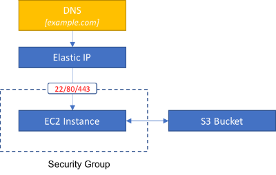

# Terraform Site

This terrraform will configure a site as illustrated below.  See http://evns.io/blog/site-setup-with-terraform for details.



## Prerequisites

* Install terraform
* Setup your AWS credentials (environment variables or profile in `~/.aws/credentials`)

## Configuration

All the configurable variables are stored in variables.tf.  

To set these variables, either edit them in place or create a new file called `terraform.tfvars` and put your variable definitions in there.
The advantage of this approach is that the tfvars file won't be version controlled so carries less risk of exposing secrets/config.

See [here](https://www.terraform.io/intro/getting-started/variables.html) for details.

## Running

To create the site framework, simply run `terraform plan` to see what will be changed/added and then `terraform apply` to actually provision the resources.

If everything is working you should see something similar to this:

```
+ aws_eip.web
    allocation_id:     "<computed>"
    association_id:    "<computed>"
    domain:            "<computed>"
    instance:          "${aws_instance.web.id}"
    network_interface: "<computed>"
    private_ip:        "<computed>"
    public_ip:         "<computed>"
    vpc:               "true"

+ aws_iam_instance_profile.web
    arn:             "<computed>"
    create_date:     "<computed>"
    name:            "web"
    path:            "/"
    roles.#:         "1"
    roles.365508689: "web"
    unique_id:       "<computed>"

+ aws_iam_role.web
    arn:                "<computed>"
    assume_role_policy: "{\n  \"Version\": \"2012-10-17\",\n  \"Statement\": [\n    {\n      \"Action\": \"sts:AssumeRole\",\n      \"Principal\": {\n        \"Service\": \"ec2.amazonaws.com\"\n      },\n      \"Effect\": \"Allow\",\n      \"Sid\": \"\"\n    }\n  ]\n}\n"
    create_date:        "<computed>"
    name:               "web"
    path:               "/"
    unique_id:          "<computed>"

+ aws_iam_role_policy.web
    name:   "web"
    policy: "{\n  \"Version\": \"2012-10-17\",\n  \"Statement\": [\n    {\n      \"Effect\": \"Allow\",\n      \"Action\": \"s3:*\",\n      \"Resource\": \"*\"\n    }\n  ]\n}\n"
    role:   "${aws_iam_role.web.id}"

+ aws_instance.web
    ami:                         "ami-ac8fd4ca"
    associate_public_ip_address: "<computed>"
    availability_zone:           "<computed>"
    ebs_block_device.#:          "<computed>"
    ephemeral_block_device.#:    "<computed>"
    iam_instance_profile:        "${aws_iam_instance_profile.web.id}"
    instance_state:              "<computed>"
    instance_type:               "t2.micro"
    key_name:                    "my-public-key"
    network_interface_id:        "<computed>"
    placement_group:             "<computed>"
    private_dns:                 "<computed>"
    private_ip:                  "<computed>"
    public_dns:                  "<computed>"
    public_ip:                   "<computed>"
    root_block_device.#:         "<computed>"
    security_groups.#:           "2"
    security_groups.365508689:   "web"
    security_groups.4002270276:  "ssh"
    source_dest_check:           "true"
    subnet_id:                   "<computed>"
    tags.%:                      "1"
    tags.Name:                   "Terraformed by Evns"
    tenancy:                     "<computed>"
    vpc_security_group_ids.#:    "<computed>"

+ aws_key_pair.ssh_public_key
    fingerprint: "<computed>"
    key_name:    "my-public-key"
    public_key:  "aaa"

+ aws_s3_bucket.backups
    acceleration_status: "<computed>"
    acl:                 "private"
    arn:                 "<computed>"
    bucket:              "backups"
    force_destroy:       "false"
    hosted_zone_id:      "<computed>"
    region:              "<computed>"
    request_payer:       "<computed>"
    tags.%:              "1"
    tags.Name:           "Terraformed by Evns"
    versioning.#:        "<computed>"
    website_domain:      "<computed>"
    website_endpoint:    "<computed>"

+ aws_security_group.ssh
    description:                          "Allow SSH access"
    egress.#:                             "<computed>"
    ingress.#:                            "1"
    ingress.2541437006.cidr_blocks.#:     "1"
    ingress.2541437006.cidr_blocks.0:     "0.0.0.0/0"
    ingress.2541437006.from_port:         "22"
    ingress.2541437006.protocol:          "tcp"
    ingress.2541437006.security_groups.#: "0"
    ingress.2541437006.self:              "false"
    ingress.2541437006.to_port:           "22"
    name:                                 "ssh"
    owner_id:                             "<computed>"
    tags.%:                               "1"
    tags.Name:                            "Terraformed by Evns"
    vpc_id:                               "<computed>"

+ aws_security_group.web
    description:                          "Allow all inbound traffic on 80/443"
    egress.#:                             "1"
    egress.482069346.cidr_blocks.#:       "1"
    egress.482069346.cidr_blocks.0:       "0.0.0.0/0"
    egress.482069346.from_port:           "0"
    egress.482069346.prefix_list_ids.#:   "0"
    egress.482069346.protocol:            "-1"
    egress.482069346.security_groups.#:   "0"
    egress.482069346.self:                "false"
    egress.482069346.to_port:             "0"
    ingress.#:                            "2"
    ingress.2214680975.cidr_blocks.#:     "1"
    ingress.2214680975.cidr_blocks.0:     "0.0.0.0/0"
    ingress.2214680975.from_port:         "80"
    ingress.2214680975.protocol:          "tcp"
    ingress.2214680975.security_groups.#: "0"
    ingress.2214680975.self:              "false"
    ingress.2214680975.to_port:           "80"
    ingress.2617001939.cidr_blocks.#:     "1"
    ingress.2617001939.cidr_blocks.0:     "0.0.0.0/0"
    ingress.2617001939.from_port:         "443"
    ingress.2617001939.protocol:          "tcp"
    ingress.2617001939.security_groups.#: "0"
    ingress.2617001939.self:              "false"
    ingress.2617001939.to_port:           "443"
    name:                                 "web"
    owner_id:                             "<computed>"
    tags.%:                               "1"
    tags.Name:                            "Terraformed by Evns"
    vpc_id:                               "<computed>"


Plan: 9 to add, 0 to change, 0 to destroy.
```
